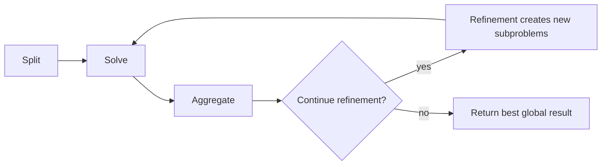

# Choose a QSplit pipeline

Choose a split method, a compatible aggregator and an optional refinement method.
These choices work in both Python and the distributed CWL/StreamFlow workflows.
For installation and a runnable local example, start with [README.md](README.md).

- [Split and aggregate compatibility](#split-and-aggregate-compatibility)
- [Refinement choices](#refinement-choices)
- [Configure a pipeline](#configure-a-pipeline)
- [Place the steps](#place-the-steps)
- [Python entry points](#python-entry-points)

## Split and aggregate compatibility

The table uses the actual method names accepted by CWL settings. ✓ marks a valid
pairing. `aggregate_method: auto` selects the aggregator with the same name as the
splitter; the three general vote aggregators can be used with every splitter.

| Split / aggregate | `linear` | `linear_belief_propagation` | `recursive_graph` | `recursive` | `k_interactions` | `quadtree` |
| --- | :---: | :---: | :---: | :---: | :---: | :---: |
| `linear` | ✓ | ✓ | ✓ | — | — | — |
| `recursive` | ✓ | ✓ | ✓ | ✓ | — | — |
| `k_interactions` | ✓ | ✓ | ✓ | — | ✓ | — |
| `recursive_graph` | ✓ | ✓ | ✓ | — | — | — |
| `quadtree` | ✓ | ✓ | ✓ | — | — | ✓ |

Choose a splitter by the neighbourhoods you want:

- `linear`: matrix windows, optionally overlapping through `STRIDE`.
- `recursive`: recursive matrix blocks, with optional tree aggregation.
- `k_interactions`: neighbourhoods built from strong interactions.
- `recursive_graph`: bounded graph partitions using PyMetis.
- `quadtree`: exact local variables plus compressed groups; tune `EXACT_RATIO`.

For general aggregation, `linear` counts all binary samples,
`linear_belief_propagation` weights samples by energy, and `recursive_graph`
votes using each subproblem's best sample. The other aggregators use their
pipeline's tree structure or centre weighting, which explains their restrictions.

`cut_dim` bounds the matrix/window dimension. Initial off-diagonal linear or
recursive blocks can contain up to twice that many distinct solver variables.
Quadtree requires at least 2 and rounds its dimension down to an even number.
Recursive tree aggregation uses classical conflict repair; its large-conflict
fallback requires the `dwave` extra on the aggregation worker.

## Refinement choices

Every valid pairing above supports all three refinement strategies.

| `refinement_method` | Behaviour |
| --- | --- |
| `none` | Return the initial aggregate result |
| `conditioned` | Solve one bounded block at a time, holding outside variables at their current values; accept globally non-worsening updates |
| `mean_field` | Rebuild real-variable windows using fractional boundary fields from shared beliefs |
| `soft_consensus` | Add soft agreement penalties, preserving quadtree macrovariable groups |
| `consensus` | Select soft-consensus when macrovariable templates exist, otherwise mean-field |

For consensus methods, the logical cycle is:



Initial splitting runs once. In subsequent consensus rounds, aggregation happens
inside the CWL `update` step and uses `refinement_aggregate_method`.
`merge_solved` only collects files; it does not combine variable assignments.

Conditioned refinement composes the global assignment one block at a time.
Each accepted update is visible to the next block; it does not use the consensus
aggregator. One sweep visits every real variable in shuffled blocks.

`refinement_loops` counts additional full sweeps or consensus rounds. The first
round runs when enabled with a positive budget. Later rounds continue while
budget and patience remain, based on observed global improvement; they do not
predict future improvement. All candidates are evaluated on the original QUBO,
and the best result is retained.

## Configure a pipeline

Edit these fields in your CWL instance or dataset settings, for example:

```yaml
split_method: recursive_graph
aggregate_method: linear_belief_propagation
cut_dim: 16
refinement_method: soft_consensus
refinement_loops: 3
refinement_cut_dim: 8
refinement_aggregate_method: linear
```

Use `none` or a non-positive loop budget to disable refinement.
`refinement_cut_dim: null` reuses `cut_dim`. Consensus aggregation can be `linear`,
`linear_belief_propagation` or `recursive_graph`, independently of initialization.
Soft-consensus preserves macrovariable blocks, so `refinement_cut_dim` must
accommodate their full size.

Optional per-step YAML files tune algorithms and backends:

| CWL input | Purpose |
| --- | --- |
| `split_configs` | Splitter settings such as `STRIDE` and `EXACT_RATIO` |
| `parallel_configs`, `iqm_configs`, `quantinuum_h2_configs`, `quantinuum_h2e_configs` | Settings and credentials for the corresponding initial solver lane |
| `refinement_configs` | `REFINEMENT_TOLERANCE`, `REFINEMENT_PATIENCE`, `REFINEMENT_SEED`, `REFINEMENT_STRENGTH` |
| `refinement_solver_configs` | Settings and credentials for refinement solves |
| `aggregate_configs`, `storage_configs` | Initial aggregation and storage settings |

Each input accepts an ordered array of YAML `File` objects; later files override
earlier values. For example, paths are relative to the CWL settings file:

```yaml
refinement_solver_configs:
  - class: File
    path: ../../configs/solver.yaml
```

See [the configuration template](qsplit.config.template.yaml) for
available keys. Workflow method and budget inputs control distributed refinement;
`REFINEMENT_METHOD` and `REFINEMENT_LOOPS` are used by the Python controller.

`refinement_backend: null` uses connector/config selection. Refinement can use a
different backend from initialization. `QSPLIT_SOLVER_MODULE` selects a custom
module exposing `solve(qubo) -> pandas.DataFrame`.

## Place the steps

Change StreamFlow bindings to move work between deployments. For `instance.cwl`:

| Binding | Role |
| --- | --- |
| `/split`, `/aggregate` | Initial classical computation |
| `/parallelize`, `/iqm`, `/quantinuum_h2`, `/quantinuum_h2e` | Initial solver lanes |
| `/initialize_refinement`, `/refine/prepare`, `/refine/update` | Classical refinement control |
| `/refine/solve` | Distributed refinement solver scatter |
| `/persist_solution` | Result storage |

For the dataset workflow, prefix these paths with `/qsplit_instances`.
The [local](streamflow/streamflow.local.template.yml) and
[HPC](streamflow/streamflow.template.yml) templates show the bindings.
CWL transfers objectives and state between steps; storage steps need access to
the configured solutions store. Refinement feedback requires a runner supporting
`cwltool:Loop`, as the locked StreamFlow version does.

## Python entry points

Splitters live in `qsplit.splitting.split_<method>` and aggregators in
`qsplit.aggregation.aggregate_<method>`. Their usual entry points are
`split_problem(qubo, config=...)` and `aggregate_solutions(solved_subproblems, qubo)`.

For a complete recursive tree, use `split_recursive.split_leaves` with
`aggregate_recursive.aggregate_leaves`; preserve the leaf order and tree metadata.
A single recursive `aggregate_solutions` call expects exactly three sibling blocks.

`qsplit.refinement.refine_result(qubo, solve=..., config=...)` refines an already
complete global solution. Pass solved subproblems to reuse their windows and
beliefs. Numerical methods run in C++; Python handles configuration and solver calls.
The deprecated local runner also offers composed samplers and logical expansion;
logical expansion is a local initialization option.
